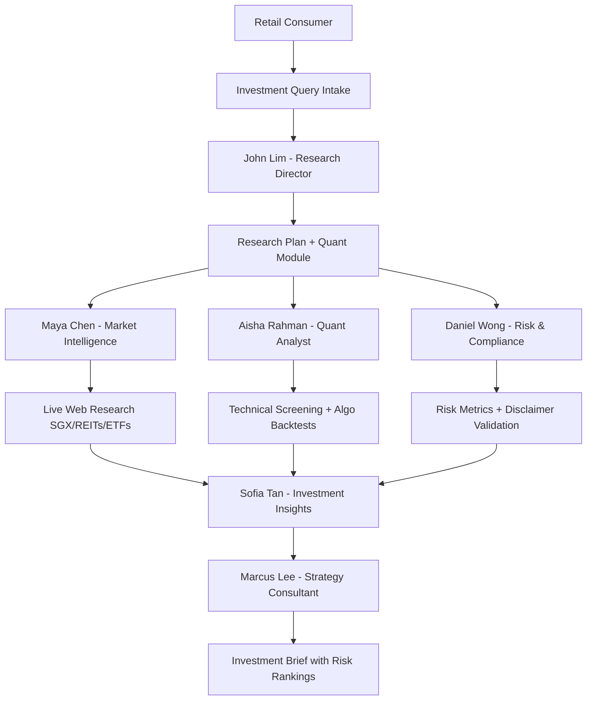

## Product Overview

Completely revamp "Field & Signal" from a general market-research agency into a Singapore-focused investment research application for retail consumers. The multi-agent AI architecture and secondary-research engine are retained, but the scope shifts to investment research on Singapore-listed equities, REITs, and ETFs. All primary fieldwork (surveys and interviews) is removed. New quant and algo strategy capabilities are added, including technical indicator screening and backtested signal visualizations. Every surface prominently displays MAS-compliant disclaimers that output is educational research only and not financial advice.

## Core Features

- **Investment Query Intake**: Consumers describe an investment idea, risk appetite, and asset class focus
- **AI-Guided Research Plan**: Multi-agent approval-gated plan covering market intelligence and quant analysis
- **Market Intelligence**: AI-powered live web research on SGX-listed securities, macro trends, and sector news
- **Quant Lab**: Technical indicator screening (RSI, MACD, moving averages) and rule-based algo strategy backtesting with interactive Recharts performance charts
- **Risk Assessment**: Portfolio-level risk metrics (Sharpe ratio, max drawdown, volatility) and risk-ranked recommendations
- **Investment Research Brief**: Final deliverable with evidence-linked, risk-ranked investment opinions
- **Regulatory Compliance**: Persistent MAS disclaimer banners, "Educational Research Only" framing, risk warnings, no guaranteed return claims

## Tech Stack

- **Frontend**: Next.js 15 App Router, React 19, TypeScript, Tailwind CSS, Recharts
- **Backend**: Next.js API routes, Supabase PostgreSQL with Row Level Security
- **AI**: OpenAI Responses API with Zod structured outputs
- **State Management**: Server-side state machines (pattern reused from secondary-research-server.ts)
- **Testing**: Vitest
- **Deployment**: Vercel

## Implementation Approach

Strip all primary fieldwork code (surveys, interviews, fieldwork APIs, public token routes) and remove associated database tables. Retain the 6-agent architecture but redesign roles for investment research. Repurpose the existing secondary-research state machine pattern for a new Quant Analysis module that generates technical screening and backtest visualizations via AI structured outputs, rendered with Recharts. Add a persistent `DisclaimerBanner` layout component and embed risk warnings into every page and the brief output. Keep all existing security patterns (server-only API keys, HTTP-only hashed session cookies).

### Key Technical Decisions

- **Quant data strategy**: Use AI-generated backtest simulations and technical screening reports based on web-researched market context, clearly labeled as illustrative research (not live trading data). This avoids complex market data API integrations while delivering consumer value.
- **Agent redesign**: Aisha Rahman becomes Quantitative Analyst; Daniel Wong becomes Risk & Compliance Analyst. This fills the gap left by removing primary fieldwork while adding required capabilities.
- **Database migration**: Create a new migration that drops fieldwork tables and adds `quant_analyses` and `risk_assessments` tables, preserving existing project/plan/finding/brief chains.
- **Regulatory layer**: Implement a reusable `RegulatoryWrapper` component to ensure disclaimers are present on every route without duplicating code.

## Architecture Design

## Directory Structure

### Removed

- `app/api/fieldwork/**` — all fieldwork API routes
- `app/api/survey-responses/route.ts`
- `app/api/interview-consent/route.ts`
- `app/api/interview-message/route.ts`
- `app/api/interview-transcribe/route.ts`
- `app/projects/[id]/survey/page.tsx`
- `app/projects/[id]/interviews/page.tsx`
- `app/survey/[publicToken]/` — public survey pages
- `app/interview/[publicToken]/` — public interview pages
- `lib/fieldwork.ts`
- `components/fieldwork-action-status.tsx`
- `components/survey-export-tools.tsx`
- `supabase/migrations/002_functional_fieldwork.sql`

### Modified

- `lib/agents.ts` — [MODIFY] Redesign 6 agent prompts for investment research roles
- `lib/schemas.ts` — [MODIFY] Add Zod contracts for quant outputs, risk ratings, backtest results; remove fieldwork schemas
- `lib/types.ts` — [MODIFY] Remove fieldwork types, add `QuantAnalysis`, `RiskAssessment`, `BacktestResult` types
- `lib/demo-data.ts` — [MODIFY] Replace Northstar Cinemas with Singapore investment demo engagement
- `lib/research-plan.ts` — [MODIFY] Update plan generation to include quant analysis phase
- `app/layout.tsx` — [MODIFY] Inject persistent disclaimer banner
- `app/page.tsx` — [MODIFY] Rebrand landing page for investment research
- `app/projects/new/**` — [MODIFY] Intake forms focused on investment goals and risk appetite
- `app/projects/[id]/plan/page.tsx` — [MODIFY] Investment research plan timeline
- `app/projects/[id]/secondary-research/page.tsx` — [MODIFY] Market intelligence UI
- `app/projects/[id]/analysis/page.tsx` — [MODIFY] Investment insights workspace
- `app/projects/[id]/brief/page.tsx` — [MODIFY] Investment brief with risk rankings
- `app/projects/[id]/command-centre/page.tsx` — [MODIFY] Updated agent roster and flow
- `components/nav.tsx` — [MODIFY] New brand navigation
- `components/logo.tsx` — [MODIFY] New investment-themed logo
- `components/landing-carousel.tsx` — [MODIFY] New carousel content
- `supabase/migrations/001_initial_schema.sql` — [MODIFY] Remove fieldwork table definitions or supersede with new migration

### New

- `app/projects/[id]/quant-analysis/page.tsx` — [NEW] Quant lab page shell
- `app/projects/[id]/quant-analysis/quant-workspace.tsx` — [NEW] Technical screening tables and backtest charts
- `app/api/quant-analysis/route.ts` — [NEW] Main quant generation endpoint
- `app/api/quant-analysis/start/route.ts` — [NEW] Initiate quant analysis state machine
- `app/api/quant-analysis/status/route.ts` — [NEW] Poll quant generation status
- `lib/quant-analysis-server.ts` — [NEW] Aisha quant analysis state machine (mirrors secondary-research-server.ts pattern)
- `components/disclaimer-banner.tsx` — [NEW] Persistent MAS-compliant disclaimer banner
- `components/risk-warning-card.tsx` — [NEW] Reusable risk warning card for brief and plan pages
- `components/quant-generation-status.tsx` — [NEW] Status indicator for quant analysis generation

## Implementation Notes

- **Blast radius control**: Delete fieldwork files first in isolation to prevent broken imports from cascading. Use [subagent:code-explorer] to verify no dangling references remain.
- **Performance**: Quant analysis AI calls should use `low` reasoning effort and compact token limits, following existing inference.ts patterns. Backtest chart data should be capped at 100 data points to keep Recharts responsive.
- **Regulatory safety**: Every API response that returns a brief, plan, or finding must include a `disclaimer` field. The UI must render this before any actionable content. Never cache or persist content without the disclaimer attached.
- **Backward compatibility**: Existing `research_projects`, `research_plans`, `agent_tasks`, `sources`, `research_findings`, and `research_briefs` tables are preserved with only additive changes (new nullable columns for risk ratings).

## Design Style

Premium financial research aesthetic with a dark, authoritative palette. Deep navy and slate backgrounds create a professional trading-terminal atmosphere, while emerald and gold accents signal positive metrics and premium quality. Crimson is reserved strictly for risk warnings and drawdowns. Card-based layouts with subtle glassmorphism separate dense data sections. Typography emphasizes numerical clarity for retail investors.

## Page Planning

1. **Landing Page**: Full-bleed dark hero with investment-themed value proposition, agent roster cards, and a prominent MAS disclaimer banner above the fold
2. **New Project Flow**: Clean intake focused on investment query, risk tolerance slider, and asset class multi-select (Equities / REITs / ETFs)
3. **Research Plan**: Timeline visualization showing Market Intelligence and Quant Analysis phases with cost breakdown and approval gate
4. **Market Intelligence**: Source cards with financial sentiment tags, macro trend summaries, and sector heat indicators
5. **Quant Lab**: Split-pane layout with technical screening table (RSI, MACD, MA crossovers) on the left and interactive backtest performance chart (equity curve, drawdowns) on the right
6. **Investment Brief**: Executive summary with risk-ranked recommendation cards, portfolio allocation pie chart, and evidence-linked source footnotes

## Block Design Rules

- Every page except the landing page includes a top disclaimer banner block and a bottom risk warning block
- The Quant Lab uses a data-dense table block + chart block layout with hover tooltips on chart data points
- The Brief page uses a hero metric block (Sharpe, Max Drawdown, Expected Risk) followed by recommendation cards and an allocation chart block

## Agent Extensions

### SubAgent

- **code-explorer**
- Purpose: Perform a comprehensive cross-repository search to identify every file, import, type reference, and route related to fieldwork, surveys, and interviews that must be removed or updated
- Expected outcome: A complete inventory of deletion targets and modification points to ensure zero dangling references after the strip phase