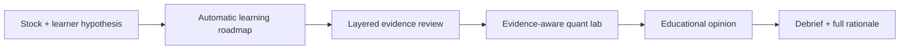
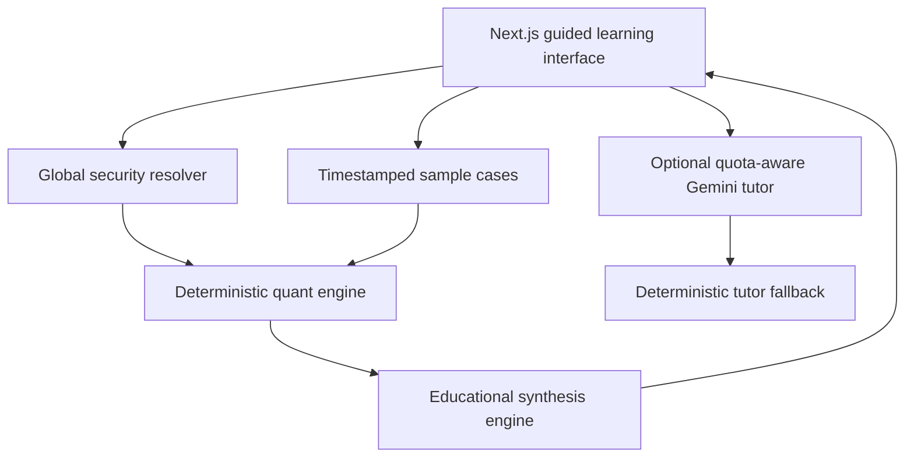

# Longview Research

> **Learn how a stock opinion is built.**

Longview Research is a Life Agent for retail-investor education. A learner names a listed company and records what first caught their attention. Longview then guides them through the same broad sequence an evidence-led analyst might use: frame a hypothesis, scan public coverage, test the evidence available, compare competing interpretations, and explain the resulting opinion.

The product publishes an **Independent Educational Opinion Piece**. It does not tell a person whether to buy, sell, hold, size, or time a position. The learner's hypothesis changes the teaching prompts, never the financial model or published conclusion.

## Hackathon submission

| Field | Submission detail |
|---|---|
| Event | AIT x Tencent Hackathon — Singapore 2026 Challenge |
| Track | **Life Agent** |
| Product used | **Tencent Cloud CodeBuddy** |
| Audience | Self-directed retail investors learning how equity analysis works |
| Short blurb | **Learn how a stock opinion is built.** |
| Reliable demo | `/research/NVDA` |
| Repository | `https://github.com/MT7654/longviewresearch` |

## The problem

Retail investors can easily find headlines, price targets, forum narratives, and unexplained ratings. It is much harder to see:

- which statements are observed facts and which are interpretations;
- what assumptions make a valuation mathematically possible;
- why reasonable methods disagree;
- when a familiar model is inappropriate for a company;
- how an initial hunch can bias later research; and
- what evidence would weaken a compelling story.

Longview turns the finished answer into an inspectable learning journey.

## The product journey



### 1. Starting point

The learner selects a stock and may write what caught their attention, what they currently believe, and how familiar they are with the company. This is an educational baseline, not a suitability questionnaire.

### 2. Automatic roadmap

Longview explains the research sequence it will follow. There is no research-plan approval step and no configuration burden for the learner.

### 3. Evidence review

Evidence is separated into visible editorial layers:

- observed fact;
- source interpretation;
- deterministic calculation; and
- Longview opinion.

Each item carries a direction, source, date, and reliability cue. The interface explicitly asks what would confirm or weaken the learner's opening hypothesis.

For arbitrary companies, Longview automatically scans current public Yahoo Finance coverage, deduplicates and relevance-filters the results, links to the original publishers, groups headlines into research themes, and measures source diversity and narrative concentration. Headline classification is a navigation aid—not proof that an article's underlying claims are true.

### 4. Automatic quant lab

The app runs only the methods supported by the available evidence:

- reverse discounted cash flow;
- scenario DCF;
- relative valuation;
- seeded Monte Carlo valuation sensitivity;
- value, quality, momentum, and low-volatility proxies; and
- historical return, volatility, and drawdown measures;
- GARCH(1,1) conditional-volatility estimation;
- historical Value at Risk and expected shortfall; and
- seeded Monte Carlo market-risk simulation.

Every result now appears in a **Quant Playbook** that identifies the strategy, the question it answers, its current output, the correct interpretation, and its main failure mode. A separate **Quantitative Model Library** classifies ten model families as applied, eligible, or blocked for the current security. It includes DCF and reverse DCF, earnings multiples, residual income, CAPM/Fama–French regression, GARCH, VaR/expected shortfall, market-risk Monte Carlo, Black–Scholes–Merton/binomial trees, Heston, and cointegration. Longview never runs a model merely because it sounds sophisticated: an options-pricing model is not a common-stock valuation model, and a factor regression is not intrinsic value.

### 5. Independent Educational Opinion Piece

Longview synthesises a thesis, counter-thesis, coverage grade, risks, evidence ledger, and standardised model opinion. The header states whether the reference price is above, inside or below the displayed model range—or that valuation is not assessable. The full piece explains what secondary research contributed, what every quant method found, how those strands combine, and why each evidence item matters. A dated mechanical range appears only when the inputs support one; otherwise the piece explicitly states the model boundary and publishes a narrative-and-market-behaviour lesson instead. No output is a recommended target price.

### 6. Educational debrief

The learner sees how their opening hypothesis survived or changed, what the secondary research found, what the quantitative strategies show, where uncertainty remains, and how an institutional analyst would challenge the result. The three-question comprehension check is generated deterministically from the selected company’s actual narrative, valuation and risk results, so the questions and answers change with the analysis while remaining reproducible.

Risks, limitations, source dates, and the non-reliance notice are never hidden behind the gate.

## What makes it an AI agent

Longview is a bounded, multi-step analytical workflow rather than a general chat box:

1. resolve the exact security and listing;
2. classify available evidence and coverage;
3. execute deterministic quantitative methods;
4. synthesise competing cases;
5. teach against the learner's original hypothesis;
6. optionally ask Gemini for a plain-language model critique; and
7. fall back to a local deterministic tutor if inference is unavailable.

The language model never owns the canonical arithmetic, data coverage decision, model range, or published model opinion.

## Cost and reliability design

The credential-free sample path is the most reproducible demo. Arbitrary-stock research uses public Yahoo Finance search, chart, and fundamental time-series endpoints with visible attribution and graceful failure. Hugging Face, Reddit, paid scrapers, and paid market-data APIs are not used.

### Data inventory and model selection

Before displaying a quant result, Longview inventories the resolved identity, price history, free cash flow, earnings and public coverage. The model selector then chooses:

- **Discounted cash flow** when positive cash flow per share, earnings and a reference price are available;
- **earnings-multiple scenarios** when earnings exist but industrial free cash flow is unavailable or unsuitable, including the bank-learning path;
- **GARCH, historical VaR/expected shortfall and zero-drift market-risk Monte Carlo** whenever the price history meets the method’s minimum depth;
- **narrative concentration and historical-risk methods** when no defensible financial valuation input exists;
- **CAPM/Fama–French regression** only after aligned benchmark and factor-return data is available;
- **residual income / justified price-to-book** only after bank book value, sustainable ROE, capital and credit data is available; and
- **BSM, binomial and Heston** only for a specified derivative contract or calibrated option surface—not to manufacture a common-stock target.

The data pipeline uses annual and trailing four-quarter public financial series. For US-listed companies, the server also attempts to fill missing fields from the SEC Company Facts XBRL API and labels successful SEC records as primary evidence.

Google Finance is not used as a hidden scraper. Google officially exposes `GOOGLEFINANCE` as a Google Sheets function, states that most international exchanges are unsupported, and states that historical data cannot be accessed through the Sheets API or Apps Script. It is therefore not a dependable server-side global-data API for this build.

Official data references:

- [Google Finance function and access limitations](https://support.google.com/docs/answer/3093281)
- [SEC EDGAR application programming interfaces](https://www.sec.gov/search-filings/edgar-application-programming-interfaces)

Gemini is optional and only called when the learner requests a model challenge. The server:

- uses configurable primary and fallback models;
- caches successful responses in memory;
- retries transient failures once;
- recognises common rate-limit responses;
- applies a short cooldown; and
- returns a deterministic educational critique if every route fails.

Switching models may help when a limit is model-specific, but it is not treated as a way to bypass project-wide quotas. The app remains fully usable without an LLM call.

Official references:

- [Gemini API rate limits](https://ai.google.dev/gemini-api/docs/rate-limits)
- [Gemini API pricing](https://ai.google.dev/gemini-api/docs/pricing)
- [Gemini models](https://ai.google.dev/gemini-api/docs/models)

## Data and global coverage

The search adapter accepts company names and global provider symbols such as `NVDA`, `D05.SI`, `0700.HK`, and `ASML.AS`. It resolves exchange, currency, country, and instrument type where available.

The hackathon build uses public Yahoo search and chart endpoints for discovery and price history. This is not a licensed production data feed. Arbitrary securities may therefore open in a partial-coverage state when model-ready fundamentals are unavailable.

Four frozen demonstrations guarantee a stable judge path:

| Symbol | Company | Market | Demonstrates |
|---|---|---|---|
| `NVDA` | NVIDIA | Nasdaq / USD | Complete end-to-end lesson |
| `D05.SI` | DBS Group | SGX / SGD | Bank-model boundary |
| `0700.HK` | Tencent | HKEX / HKD | Asian global listing |
| `ASML.AS` | ASML | Euronext / EUR | European global listing |

Sample observations are clearly labelled and should not be represented as current market data.

## Editorial and regulatory boundary

Longview is designed as a general-circulation educational publication:

- no income, wealth, holdings, loss capacity, risk-tolerance, or desired-return fields;
- no personalised ranking or suitability decision;
- no position size, transaction timing, or brokerage action;
- no buy, sell, hold, accumulate, reduce, or avoid instruction;
- no issuer-sponsored coverage, referral fee, or broker affiliate path;
- visible separation of sources, calculations, interpretation, and opinion;
- dated assumptions, model limitations, AI-use disclosure, and conflict disclosure;
- public editorial, sourcing, correction, and versioning policy.

Singapore's Financial Advisers Act can cover express or implied recommendations and electronic research analyses. Product language and disclaimers are therefore safeguards, not a substitute for legal classification. Independent Singapore counsel is required before commercial launch or live arbitrary-security publication.

- [Financial Advisers Act 2001](https://sso.agc.gov.sg/Act/FAA2001)
- [Longview editorial policy](/editorial-policy)
- [Longview methodology](/methodology)

This repository is not a legal opinion.

## Architecture



### Technology

- Next.js 16 App Router through the vinext Cloudflare runtime
- React 19 and strict TypeScript
- Google GenAI SDK with Zod validation
- Recharts and Lucide
- Vitest and ESLint
- Cloudflare-compatible deployment

No database is required for the hackathon journey. Learning state is saved only in the browser's local storage.

### Key files

| Concern | File |
|---|---|
| Global search and public chart adapter | `lib/security-provider.ts` |
| Frozen sample cases | `lib/samples.ts` |
| Quantitative calculations | `lib/quant.ts` |
| Educational synthesis and hypothesis guardrail | `lib/education.ts` |
| Optional Gemini routing and fallback | `lib/gemini.ts` |
| Guided learning workspace | `app/research/[symbol]/workspace.tsx` |
| Editorial governance | `app/editorial-policy/page.tsx` |
| Public methodology | `app/methodology/page.tsx` |
| Automated verification | `tests/` |

## Local setup

### Requirements

- Node.js 22.13 or newer for the Cloudflare-compatible build
- npm
- optional Google Gemini API key

### Install

```bash
git clone https://github.com/MT7654/longviewresearch.git
cd longviewresearch
npm install
copy .env.example .env
npm run dev
```

On macOS or Linux, use `cp .env.example .env`. Then open `http://localhost:3000`.

### Environment variables

| Variable | Required | Purpose |
|---|---:|---|
| `GOOGLE_API_KEY` | No | Enables the optional Gemini model challenger |
| `GEMINI_PRIMARY_MODEL` | No | Overrides the primary tutor model |
| `GEMINI_FALLBACK_MODELS` | No | Comma-separated fallback list |
| `NEXT_PUBLIC_APP_URL` | No | Canonical deployment origin |

Never expose the Gemini key with a `NEXT_PUBLIC_` prefix. The entire sample journey works without it.

## Verification

```bash
npm run typecheck
npm run lint
npm test
npm run build
```

Current baseline:

- strict TypeScript passes;
- ESLint passes with zero warnings;
- 13 automated tests pass;
- deterministic model and education-layer tests pass;
- sample flow requires no credentials.

## Judge walkthrough

Use the complete script in [JUDGING_GUIDE.md](./JUDGING_GUIDE.md).

The shortest reliable path is:

1. Open the landing page and choose NVIDIA.
2. Write a one-sentence hypothesis.
3. Show that Longview creates the roadmap automatically.
4. Compare evidence layers and the hypothesis challenge.
5. Show automatic reverse DCF, scenario, Monte Carlo, factor, and risk outputs.
6. Open the educational opinion preview.
7. Complete the three-question debrief.
8. Export the complete Independent Educational Opinion Piece.

## Judging-criteria alignment

| Dimension | Evidence |
|---|---|
| AI Innovation — 30% | Hypothesis-aware teaching, bounded synthesis, optional Gemini critique, deterministic fallback |
| Technical Excellence — 20% | Global resolver, explicit coverage gates, reproducible simulation, formula tests, quota-aware routing |
| User Experience — 25% | One-input start, automatic journey, institutional visual system, staged learning, printable outcome |
| Business Value — 25% | Builds practical quant literacy without broker integration or personal-finance data collection |

## Product targets

These are defined design targets, not fabricated study results:

- 100% of displayed model outputs trace to visible inputs.
- 100% of opinion sections identify their editorial layer.
- Zero personal suitability fields.
- Zero buy, sell, or hold outputs.
- Complete sample journey without credentials.
- Complete calculation journey during Gemini rate limiting.
- One measurable three-question comprehension check per lesson.

## How CodeBuddy was used

Tencent Cloud CodeBuddy was used for the initial conversion of a market-entry research product into a retail-investor learning application. It accelerated repository mapping and early cross-codebase changes. The resulting build also demonstrated why agent-produced software needs explicit product boundaries, mathematical verification, and editorial governance. Longview's final architecture keeps AI in a bounded explanation role while deterministic, tested code owns every canonical number.

## Known limitations

- Public Yahoo endpoints can change and are not a production data licence.
- Arbitrary live fundamentals are not guaranteed.
- Frozen sample data is illustrative rather than current.
- The factor lens uses transparent proxies, not a full licensed factor dataset.
- Generic DCF is inappropriate for banks and some other business models.
- Taxes, country risk, dilution, restatements, ADR ratios, and historical FX need deeper production data.
- Gemini free-tier capacity is not guaranteed.
- In-memory AI cache and cooldown reset when the server restarts.
- Regulatory classification and launch language require Singapore legal review.

## Licence

Released under the [MIT License](./LICENSE).
