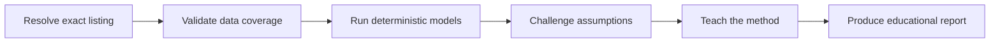
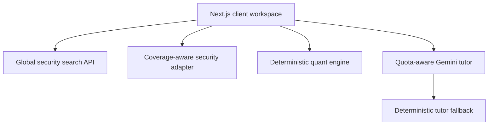

# Longview Research

> **Understand what a stock price assumes.**

Longview Research is a global equity-learning agent for retail investors. It turns reverse discounted cash flow, scenario valuation, Monte Carlo uncertainty and systematic factor concepts into an inspectable learning experience.

**Longview does not decide whether a stock is worth investing in.** It shows how different assumptions produce different valuation ranges, where the evidence is incomplete and what a learner should challenge next.

## Hackathon submission

| Field | Submission detail |
|---|---|
| Event | AIT x Tencent Hackathon — Singapore 2026 Challenge |
| Track | **Life Agent** |
| Product used | **Tencent Cloud CodeBuddy** |
| Audience | Self-directed retail investors learning how equity valuation works |
| Short blurb | **Understand what a stock price assumes.** |
| Access | Browser application; no account required |
| Reliable judge path | `/research/NVDA` |
| Repository | `https://github.com/MT7654/longviewresearch` |

## The problem

Retail investors regularly encounter price targets without being shown:

- which growth and margin assumptions produced the number;
- how sensitive it is to discount rates and terminal values;
- whether the underlying data is current or complete;
- why different valuation methods disagree; or
- what quantitative factors describe the security’s historical characteristics.

The result is false precision. A single number appears authoritative even when it is conditional on fragile assumptions.

Longview replaces the opaque target with an educational question:

> **What would need to be true for this price to make mathematical sense?**

## What the agent does

Longview operates as a bounded, observable workflow:



1. **Resolve** — distinguishes symbols, exchanges, currencies and listings.
2. **Validate** — exposes available price history, fundamentals and peer context.
3. **Model** — calculates valuation and risk outputs in deterministic TypeScript.
4. **Challenge** — uses one bounded Gemini request to identify fragile assumptions.
5. **Teach** — explains methods, limitations and model disagreement.
6. **Report** — provides a printable, general-circulation learning record.

Gemini does not calculate the canonical valuation numbers. The model may critique and explain; tested code owns the arithmetic.

## Working features

### Global equity discovery

- Search by company name, symbol or exchange.
- Resolve public equity and ADR search results.
- Display exchange, country, currency and instrument type.
- Accept exact global provider symbols such as `D05.SI`, `0700.HK` and `ASML.AS`.
- Show an explicit unresolved state instead of guessing identity.

Live public search and price history use a server-side Yahoo Finance chart/search adapter. This is suitable for a hackathon demonstration, not a production data licence. Production rollout requires a licensed market-data provider.

### Coverage-aware modelling

Before calculating, Longview labels whether it has:

- verified identity;
- a reference price;
- sufficient monthly price history;
- model-ready fundamentals; and
- peer context.

Unavailable data disables the affected method. The model is never asked to manufacture a missing canonical input.

### Reverse DCF

Longview starts with the reference price and numerically solves for a constant forecast free-cash-flow growth rate:

```text
Price = Σ FCFₜ / (1 + r)ᵗ + Terminal Value / (1 + r)ⁿ − Net Debt per Share
```

The output is labelled **implied growth**, not predicted growth.

### Scenario DCF

The learner can adjust:

- free cash flow per share;
- forecast growth;
- discount rate;
- terminal growth;
- forecast years; and
- net debt per share.

The result updates immediately. A growth-versus-discount-rate sensitivity matrix exposes how fragile the result is.

### Relative valuation

An entered earnings-per-share figure and comparison multiple produce a transparent relative value:

```text
Relative value = EPS × comparison P/E
```

The interface calls this a comparison—not an intrinsic truth.

### Monte Carlo uncertainty

Longview runs 1,600 seeded simulations across:

- free cash flow per share;
- forecast growth;
- discount rate; and
- terminal growth.

It reports median and 10th–90th percentile model values. The seed makes the output reproducible in tests. The range represents sampled assumptions, not the real probability distribution of a future share price.

### Factor lens

The application presents transparent proxies for:

- value: earnings and free-cash-flow yields;
- quality: ROIC, operating margin and balance-sheet penalty;
- momentum: trailing 12–1 month price behaviour; and
- low volatility: inverse realised volatility.

The interface explicitly states that these are educational proxies, not a full Fama–French regression and not trading signals.

### Historical risk

From monthly price observations, Longview calculates:

- annualised arithmetic return;
- annualised volatility;
- return-to-volatility ratio;
- maximum drawdown; and
- trailing momentum.

### Gemini model challenger

The challenger receives only:

- symbol;
- non-personal model assumptions;
- calculated DCF result;
- reference price; and
- coverage flags.

It returns:

- a concise model critique;
- two to four pressure points; and
- a learning note.

No holdings, wealth, income, suitability or risk-tolerance data is collected.

### Learning check

Three questions test whether the learner understands:

- what reverse DCF measures;
- what a Monte Carlo valuation range means; and
- how the product should behave when data is missing.

## Sample cases

The credential-free sample desk contains four frozen, model-ready demonstrations:

| Symbol | Company | Exchange | Currency | Purpose |
|---|---|---|---|---|
| `NVDA` | NVIDIA | Nasdaq | USD | Primary end-to-end demo |
| `D05.SI` | DBS Group | SGX | SGD | Demonstrates a model boundary for banks |
| `0700.HK` | Tencent | HKEX | HKD | Asian non-Singapore listing |
| `ASML.AS` | ASML | Euronext Amsterdam | EUR | European listing |

Sample values are illustrative and clearly labelled. They are not represented as current market data. DBS intentionally disables the generic free-cash-flow DCF because banks require a different valuation framework such as residual income.

## Gemini free-tier resilience

Hugging Face is not used.

The default routing is:

1. `gemini-3.5-flash-lite`
2. `gemini-3.1-flash-lite`
3. deterministic local tutor

The inference adapter:

- makes no model call during page load;
- calls Gemini only when the user selects **Challenge this model**;
- caches successful responses in the running server process;
- retries transient failures once with a bounded delay;
- recognises common `429 RESOURCE_EXHAUSTED` responses;
- applies a temporary cooldown;
- tries a configured stable fallback model; and
- returns a deterministic educational critique if all model routes fail.

Gemini quotas are applied per Google Cloud project, not per API key. Limits differ by model and may change; the active project limits shown in Google AI Studio are authoritative. Switching models may help with a model-specific limit but does not bypass project-wide or shared tool quotas.

Relevant documentation:

- [Gemini API rate limits](https://ai.google.dev/gemini-api/docs/rate-limits)
- [Gemini API pricing and free-tier terms](https://ai.google.dev/gemini-api/docs/pricing)
- [Current Gemini models](https://ai.google.dev/gemini-api/docs/models)
- [Gemini deprecation schedule](https://ai.google.dev/gemini-api/docs/deprecations)

Because Google states that free-tier content may be used to improve its products, Longview deliberately excludes personal financial information from prompts.

## Regulatory design boundary

Longview is general-circulation educational information. It:

- does not ask about income, net worth, holdings or loss capacity;
- does not collect risk tolerance or desired returns;
- does not produce position sizes;
- does not output buy, sell, hold, accumulate, reduce or avoid labels;
- does not rank securities for a particular person;
- separates reference data, user assumptions, calculations and interpretation;
- uses ranges rather than an authoritative target price; and
- displays a prominent non-personalisation notice.

The Financial Advisers Act 2001 includes electronic advice and research analyses within financial advisory services, and recommendations can be express or implied. Disclaimers are therefore treated as one control—not as permission to provide personalised advice.

- [Singapore Financial Advisers Act 2001](https://sso.agc.gov.sg/Act/FAA2001)
- [Types of financial advisory service](https://sso.agc.gov.sg/Act/FAA2001?Phrase=electronic&ProvIds=Sc2-&ViewType=Advance&WiAl=1)

This project is not a legal opinion. Professional Singapore legal review is required before commercial launch.

## Architecture



### Technology

- Next.js 16 App Router through the vinext Cloudflare runtime
- React 19
- strict TypeScript
- Google GenAI SDK
- Zod
- Recharts
- Lucide icons
- Vitest
- ESLint

No database is required for the hackathon experience. Model inputs live only in the browser session. This reduces setup failure, privacy exposure and demo latency.

### Important files

| Concern | File |
|---|---|
| Global search and live chart adapter | `lib/security-provider.ts` |
| Frozen global sample cases | `lib/samples.ts` |
| DCF, reverse DCF, simulation and risk math | `lib/quant.ts` |
| Gemini routing and deterministic fallback | `lib/gemini.ts` |
| Global stock-search interface | `components/security-search.tsx` |
| Research desk | `app/research/[symbol]/workspace.tsx` |
| Formula and sample verification | `tests/` |

## Local setup

### Requirements

- Node.js 22.13+ required for the Cloudflare-compatible vinext build
- npm
- Optional Google Gemini API key

### Install

```bash
git clone https://github.com/MT7654/longviewresearch.git
cd longviewresearch
npm install
copy .env.example .env
npm run dev
```

On macOS or Linux, use `cp .env.example .env`.

Open `http://localhost:3000`.

### Environment variables

| Variable | Required | Default | Purpose |
|---|---:|---|---|
| `GOOGLE_API_KEY` | No | — | Enables the optional Gemini model challenger |
| `GEMINI_PRIMARY_MODEL` | No | `gemini-3.5-flash-lite` | Primary structured tutor model |
| `GEMINI_FALLBACK_MODELS` | No | `gemini-3.1-flash-lite` | Comma-separated model fallback list |
| `NEXT_PUBLIC_APP_URL` | No | `http://localhost:3000` | Canonical deployment origin |

Do not add `NEXT_PUBLIC_` to the Gemini key. `.env` and `.env.local` are ignored by Git.

## Verification

```bash
npm run typecheck
npm run lint
npm test
npm run build
```

Verified implementation baseline:

- strict TypeScript passes;
- ESLint passes with zero warnings;
- 9 deterministic tests pass; and
- the production build generates the landing page, research workspace and three server endpoints.

Tests cover:

- DCF determinism;
- invalid terminal-value assumptions;
- reverse-DCF numerical recovery;
- relative valuation;
- seeded Monte Carlo reproducibility;
- maximum drawdown;
- global sample diversity;
- sample-data labelling; and
- the bank-model boundary.

## Judge walkthrough

### Reliable 90-second path

1. Open the landing page.
2. Select **NVDA** from the sample desk.
3. Confirm the sample-data label and coverage panel.
4. Inspect market-implied growth.
5. Move the growth and discount-rate controls.
6. Observe DCF, relative and Monte Carlo outputs update.
7. Inspect the sensitivity matrix and factor lens.
8. Select **Challenge this model**.
9. Complete the learning check.
10. Show the source ledger and regulatory boundary.

### Global partial-data path

1. Search for a different listed equity using its provider symbol.
2. Confirm exchange, currency and public price-history coverage.
3. Observe that missing fundamentals are disclosed.
4. Enter a sourced FCF/share or EPS value to explore the mechanics.

## Judging-criteria alignment

| Dimension | Weight | Evidence in the product |
|---|---:|---|
| AI Innovation | 30% | Observable resolve–validate–model–challenge–teach workflow; Gemini critiques rather than fabricates arithmetic; deterministic fallback |
| Technical Excellence | 20% | Global identity adapter, coverage gates, seeded simulation, formula tests, strict TypeScript, quota-aware inference |
| User Experience | 25% | Immediate global search, institutional research-desk design, responsive controls, explicit missing-data states, learning check |
| Business Value | 25% | Makes institutional valuation concepts understandable while avoiding personalised suitability and execution |

## Quantifiable targets

These are product targets, not fabricated user-study results:

- 100% of displayed model outputs trace to visible inputs.
- 100% of sample sources are labelled with type and date.
- Zero personal suitability fields.
- Zero buy, sell or hold outputs.
- Complete sample journey without credentials.
- Calculation-only journey remains available during Gemini rate limiting.
- Three-question comprehension check built into every research desk.

## How CodeBuddy was used

Tencent Cloud CodeBuddy was used to attempt the initial hackathon pivot and generate an implementation plan. The retained `.codebuddy/plans/` artifact provides repository-level evidence of that development workflow. Subsequent work repaired the resulting scope and correctness issues while preserving the hackathon’s CodeBuddy origin.

For the submission’s required product-sharing paragraph:

> I used Tencent Cloud CodeBuddy to convert an earlier market-research application into the foundation of a consumer investment-learning agent. CodeBuddy helped map the initial product pivot and accelerate changes across a large Next.js codebase. That process also exposed an important lesson: agent-generated code still needs explicit mathematical tests, data-provenance rules and product-scope review. The final Longview architecture separates Gemini’s explanatory role from deterministic valuation code, making every calculated output reproducible and allowing the demo to keep working when free-tier inference is rate-limited.

## Known limitations

- Public Yahoo chart/search endpoints are not a licensed production feed and can change.
- Live fundamentals are not automatically retrieved in this hackathon build.
- Sample fundamentals are illustrative rather than current.
- The factor lens uses transparent proxies, not licensed institutional factor data.
- The generic DCF is inappropriate for banks and other balance-sheet-led businesses.
- Taxes, country risk, dilution, accounting restatements, ADR ratios and historical FX require deeper production data.
- In-memory Gemini cache and cooldown state reset when the server restarts.
- Gemini free-tier capacity is not guaranteed.
- Longview does not provide financial advice.

## Licence

Released under the [MIT License](./LICENSE).
